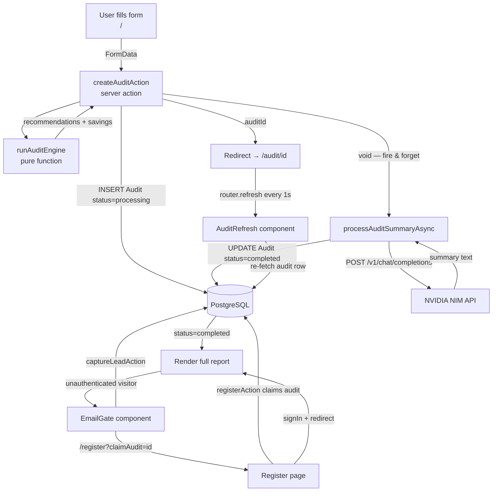

# Architecture

## Stack

| Layer     | Choice                    | Why |
| --------- | ------------------------- | --- |
| Framework | Next.js 15 (App Router)   | Server actions replace a separate API layer. RSC handles auth at the page level. |
| Database  | PostgreSQL + Prisma       | Relational data (users → audits → leads). Prisma catches schema drift at compile time. |
| Auth      | NextAuth v5 (JWT)         | JWT avoids DB hits on every middleware check. Supports credentials + GitHub OAuth. |
| AI        | NVIDIA NIM (qwen3.5-122b) | Free tier, good enough for ~100-word summaries. Provider-agnostic wrapper makes it swappable. |
| Styling   | Tailwind CSS + shadcn/ui  | Utility-first, small bundle. shadcn is copy-owned, no runtime dep. |
| State     | Zustand + localStorage    | Form state persists across reloads without a backend call. |

---

## Data Flow



**How it works:**

1. User fills the form on `/` — no login.
2. `createAuditAction` runs the deterministic engine (<5ms), saves to Postgres with `status = "processing"`, fires AI summary as a background promise.
3. User is redirected to `/audit/[id]`. `AuditRefresh` polls `router.refresh()` every second.
4. AI summary finishes (or fails → fallback). DB row updates to `status = "completed"`. Next poll renders the full report.
5. Unauthenticated visitors see `EmailGate`. Email → `Lead` record. "Create Account" → `/register?claimAudit=[id]` → claims the anonymous audit.

---

## Scaling to 10k Audits/Day

Current setup handles ~100 concurrent audits. At 10k/day (~7/min average, spikes to ~100/min):

| Bottleneck | Fix |
| --- | --- |
| NIM rate limits at 100 concurrent calls | Add BullMQ + Redis job queue. Workers process at controlled rate. |
| Serverless DB connection exhaustion | PgBouncer or Prisma Accelerate pooled URL. |
| 1000 clients polling every second | Replace polling with SSE or WebSocket push. |
| Sync audit engine blocks event loop | Move to Worker Thread or separate microservice. |

```
Current:  Browser → Next.js (monolith) → Postgres + NIM
At scale: Browser → Next.js → Redis Queue → Worker Pool → Postgres
                                                        ↘ NIM (rate-controlled)
```
