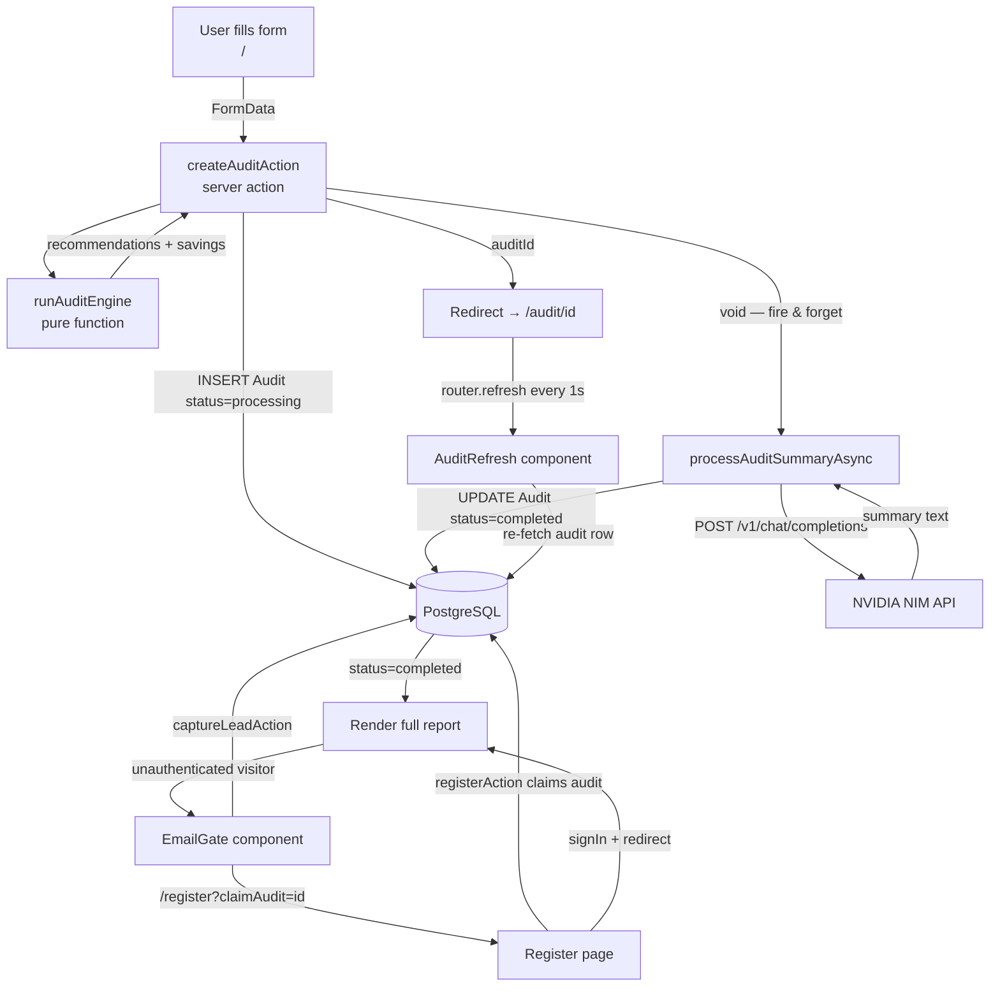

# Architecture

## Stack Choice

| Layer     | Choice                    | Why                                                                                                                       |
| --------- | ------------------------- | ------------------------------------------------------------------------------------------------------------------------- |
| Framework | Next.js 15 (App Router)   | Server actions eliminate a separate API layer. RSC handles auth checks at the page level without client-side waterfalls.  |
| Database  | PostgreSQL + Prisma       | Structured relational data (users → audits → leads). Prisma's type-safe client catches schema mismatches at compile time. |
| Auth      | NextAuth v5 (JWT)         | JWT sessions avoid a DB round-trip on every middleware check. Credentials + GitHub OAuth covers both user types.          |
| AI        | NVIDIA NIM (qwen3.5-122b) | Free tier, sufficient quality for a 100-word summary. Swappable — the wrapper is provider-agnostic.                       |
| Styling   | Tailwind CSS + shadcn/ui  | Utility-first keeps the bundle small. shadcn components are copy-owned, not a runtime dependency.                         |
| State     | Zustand + localStorage    | Form state persists across reloads without a backend round-trip. Zustand's minimal API avoids Redux boilerplate.          |

---

## Data Flow



### Narrative walkthrough

1. The user fills the form on `/` — no login required.
2. `createAuditAction` runs the deterministic audit engine synchronously (< 5ms), saves the result to Postgres with `status = "processing"`, then fires the AI summary generation as a background promise.
3. The user is immediately redirected to `/audit/[id]`. The `AuditRefresh` component polls `router.refresh()` every second.
4. When the AI summary finishes (or fails with a fallback), the DB row is updated to `status = "completed"`. The next poll renders the full report.
5. Unauthenticated visitors see an `EmailGate` at the bottom. Submitting an email saves a `Lead` record. Clicking "Create Account" goes to `/register?claimAudit=[id]`, which claims the anonymous audit after registration.

---

## Handling 10k Audits/Day

The current architecture handles ~100 concurrent audits comfortably. At 10k/day (~7/minute average, with spikes to ~100/minute):

**Bottleneck 1 — NVIDIA NIM API**
Each audit fires one LLM call. At 100 concurrent requests, NIM will rate-limit. Fix: add a job queue (BullMQ + Redis). The server action enqueues the summary job and returns immediately. Workers process the queue at a controlled rate.

**Bottleneck 2 — PostgreSQL connection pool**
Serverless functions open a new connection per invocation. Fix: add PgBouncer (connection pooler) in front of Postgres, or switch `DATABASE_URL` to a pooled Prisma Accelerate URL.

**Bottleneck 3 — `router.refresh()` polling**
At scale, 1000 clients polling every second creates unnecessary load. Fix: replace polling with Server-Sent Events (SSE) or a WebSocket channel that pushes the `completed` event to the specific client.

**Bottleneck 4 — Audit engine is CPU-bound**
The rule engine is synchronous and runs in the Node.js event loop. At high concurrency this blocks other requests. Fix: move it to a Worker Thread or a dedicated microservice.

```
Current:  Browser → Next.js (monolith) → Postgres + NIM
At scale: Browser → Next.js → Redis Queue → Worker Pool → Postgres
                                                        ↘ NIM (rate-controlled)
```
